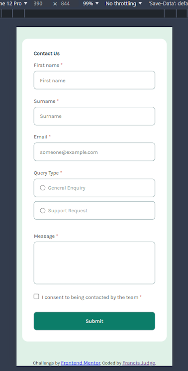
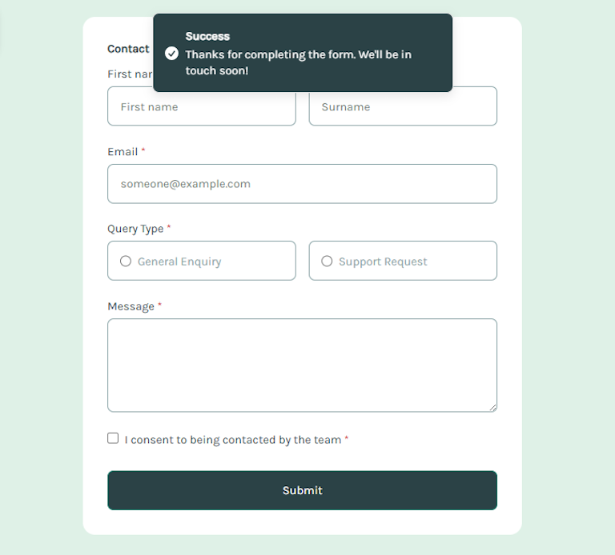
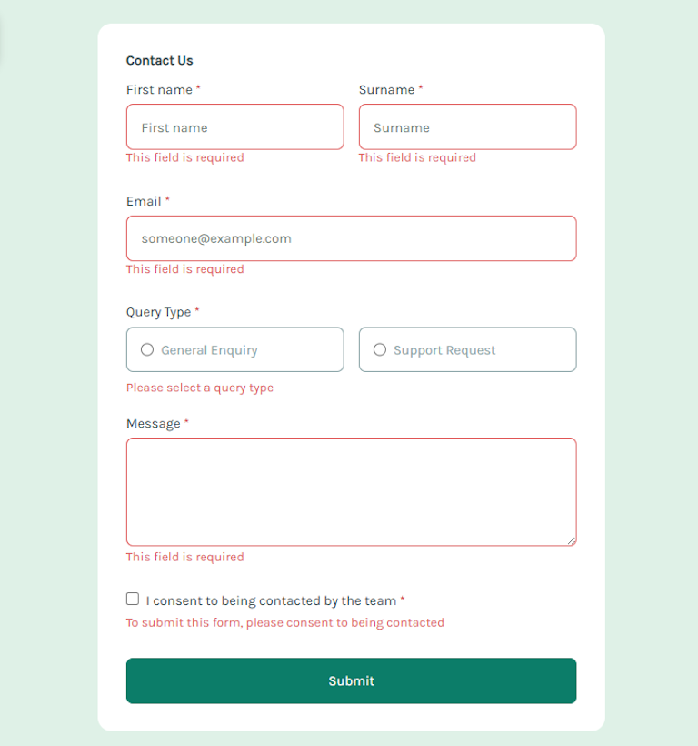

# Frontend Mentor - Contact form solution

This is my solution to
the [Contact form challenge on Frontend Mentor](https://www.frontendmentor.io/challenges/contact-form--G-hYlqKJj).
Frontend Mentor challenges help you improve your coding skills by building realistic projects.

## Table of contents

- [Overview](#overview)
    - [The challenge](#the-challenge)
    - [Screenshot](#screenshot)
    - [Links](#links)
- [My process](#my-process)
    - [Built with](#built-with)
    - [What I learned](#what-i-learned)
    - [Continued development](#continued-development)
    - [AI Collaboration](#ai-collaboration)
- [Author](#author)

## Overview

### The challenge

### Screenshot

#### Mobile view



#### Desktop view (success)



#### Desktop view (error)



### Links

- Solution URL:
- Live Site URL:

## My process

### Built with

- Semantic HTML5 markup
- CSS custom properties
- Flexbox
- CSS Grid
- Mobile-first workflow
- [Preact](https://preactjs.com/) - JS library
- [TS-Pattern](https://github.com/gvergnaud/ts-pattern) - TypeScript pattern-matching
- [LightningCSS](https://lightningcss.dev/) - For styles
- [Zod](https://zod.dev/) - For validation
- [Sonner](https://sonner.emilkowal.ski/) - Toast

### What I learned

Use this section to recap over some of your major learnings while working through this project.
Writing these out and providing code samples of areas you want to highlight is a great way to
reinforce your own knowledge.

To see how you can add code snippets, see below:

```html
<h1>Some HTML code I'm proud of</h1>
```

```css
.proud-of-this-css {
  color: papayawhip;
}
```

```js
const proudOfThisFunc = () => {
  console.log('🎉')
}
```

### Continued development

Save the data in a database for later use.

### Useful resources

- [Example resource 1](https://www.example.com) - This helped me for XYZ reason. I really liked this
  pattern and will use it going forward.
- [Example resource 2](https://www.example.com) - This is an amazing article which helped me finally
  understand XYZ. I'd recommend it to anyone still learning this concept.

**Note: Delete this note and replace the list above with resources that helped you during the
challenge. These could come in handy for anyone viewing your solution or for yourself when you look
back on this project in the future.**

### AI Collaboration

Describe how you used AI tools (if any) during this project. This helps demonstrate your ability to
work effectively with AI assistants.

- What tools did you use (e.g., ChatGPT, Claude, GitHub Copilot)?
- How did you use them (e.g., debugging, generating boilerplate, brainstorming solutions)?
- What worked well? What didn't?

## Author

- Frontend Mentor - [Francis Judge](https://www.frontendmentor.io/profile/FJSolutions)
